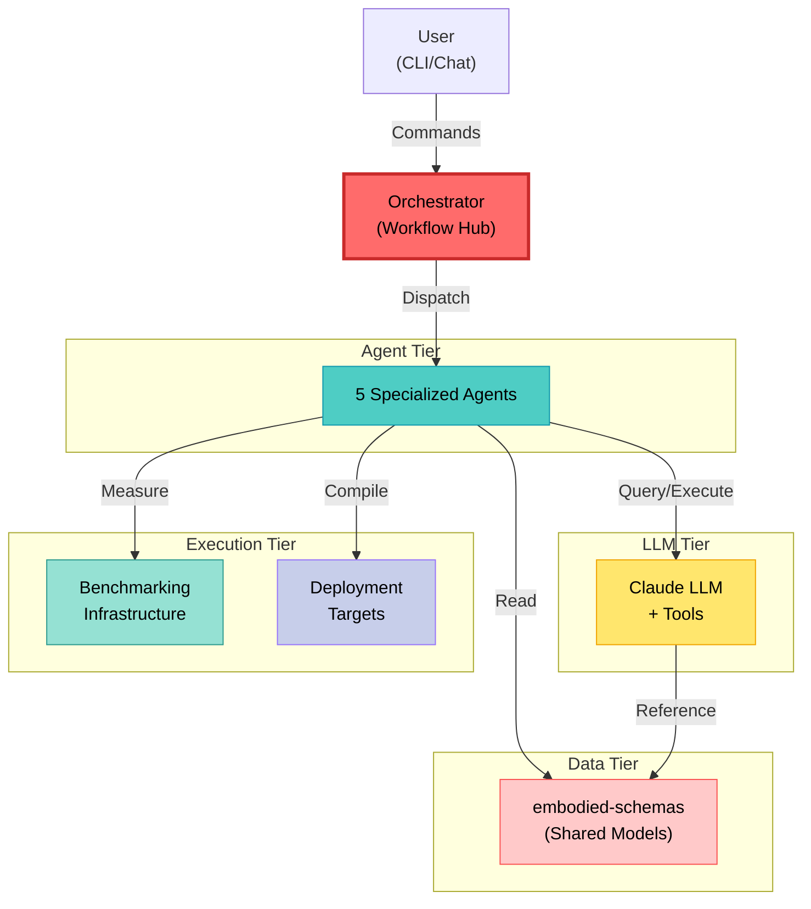
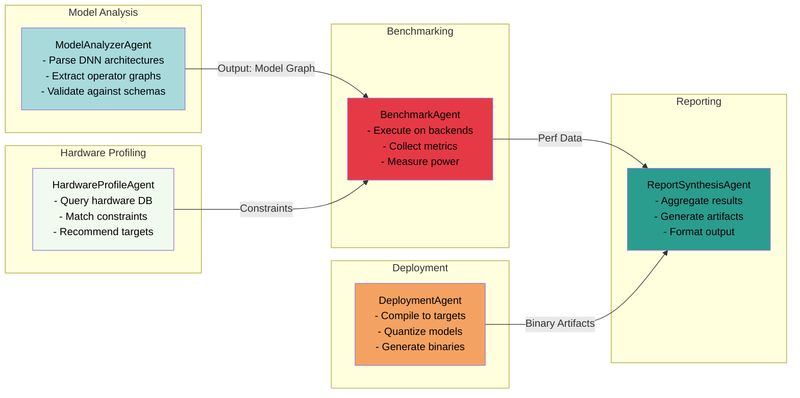
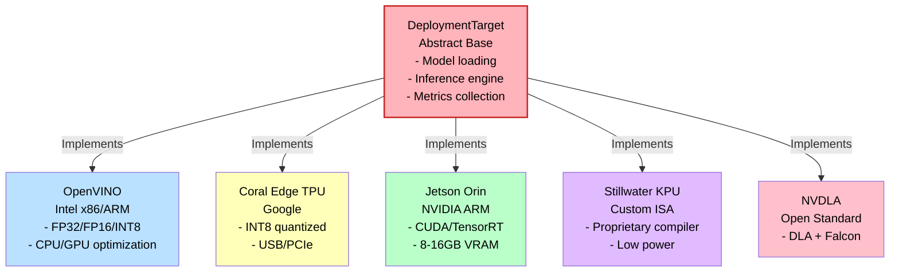
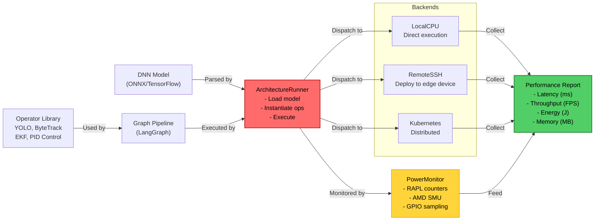
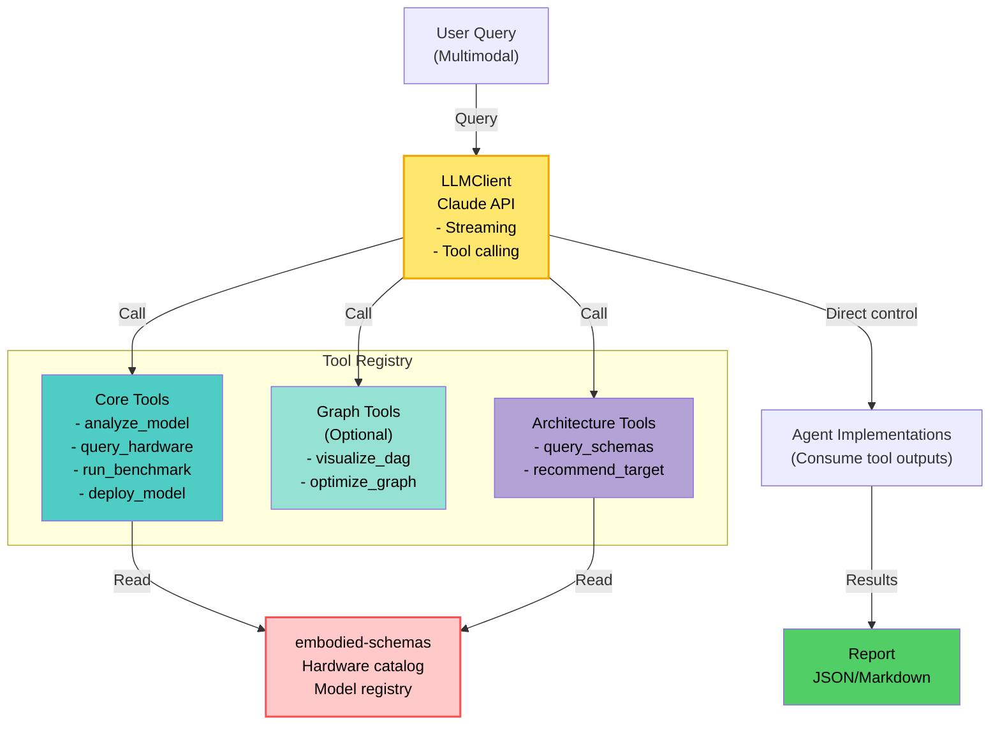

# Embodied AI Architect Software Architecture

## System Overview

The diagram below shows the top level architecture.

User → Orchestrator → Agents → (LLM/Bench/Deploy/Schemas)

---
Diagram A: High-Level System Context`
---

## Component Responsibilities
See: `Diagram B: Agent Responsibilities`

## Agent Responsibilities

Each agent has a single responsibility. We have a collection of agents that follow this data dependency chain.

## Execution Flow
1. User submits query via CLI or chat
2. Orchestrator dispatches to relevant agents
3. Agents call LLM tools for decision-making
4. Tools query `embodied-schemas` and run benchmarks
5. Results aggregated into report

Each target provides a concrete implementation.

## Adding a New Deployment Target
1. Subclass `DeploymentTarget` (Diagram C)
2. Implement: `load()`, `infer()`, `cleanup()`
3. Register in agent configuration

## Benchmarking Pipeline
See: `Diagram D: Benchmarking Data Flow`

---
Diagram D: Benchmarking Data Flow
---

## Adding a New Tool
1. Define in `llm/tools.py`
2. Register with LLMClient
3. Update agent to call it

## LLM Integration & Tool Ecosystem

The diagram shows the tool calling pattern. The LLM is orchestrating the tool calls to gather and resolve design information.

## All together

```mermaid
graph TB
    subgraph "User Interface Layer"
        CLI["CLI Commands<br/>cli/commands/"]
        Chat["Interactive Chat<br/>llm/agent.py"]
    end

    subgraph "Orchestration Layer"
        Orchestrator["Orchestrator<br/>orchestrator.py<br/>(Workflow Coordination)"]
    end

    subgraph "Agent Layer"
        ModelAnalyzer["ModelAnalyzerAgent<br/>agents/model_analyzer/"]
        HardwareProfile["HardwareProfileAgent<br/>agents/hardware_profile/"]
        Benchmark["BenchmarkAgent<br/>agents/benchmark/"]
        Deployment["DeploymentAgent<br/>agents/deployment/"]
        ReportSynthesis["ReportSynthesisAgent<br/>agents/report_synthesis/"]
    end

    subgraph "LLM Integration"
        LLMClient["LLMClient<br/>llm/client.py<br/>(Anthropic API)"]
        Tools["Tool Definitions<br/>llm/tools.py"]
        GraphsTools["Graphs Tools<br/>llm/graphs_tools.py<br/>(Optional)"]
        ArchTools["Architecture Tools<br/>llm/architecture_tools.py"]
    end

    subgraph "Deployment Targets"
        OpenVINO["OpenVINO Target"]
        Coral["Coral Edge TPU"]
        Jetson["Jetson Target"]
        KPU["Stillwater KPU"]
        NVDLA["NVDLA Target"]
        Base["DeploymentTarget<br/>Base Class"]
    end

    subgraph "Benchmarking Infrastructure"
        ArchRunner["ArchitectureRunner<br/>benchmark/runner.py"]
        LocalCPU["LocalCPUBackend"]
        RemoteSSH["RemoteSSHBackend"]
        Kubernetes["KubernetesBackend"]
        PowerMonitor["PowerMonitor<br/>benchmark/power.py<br/>(RAPL, SMU)"]
    end

    subgraph "Operators"
        OperatorBase["Operator Base<br/>operators/base.py"]
        YOLOOp["YOLOv8 ONNX<br/>operators/perception/"]
        ByteTrackOp["ByteTrack<br/>operators/perception/"]
        EKFOp["EKF 6-DoF<br/>operators/state_estimation/"]
        ControlOp["PID Controller<br/>operators/control/"]
    end

    subgraph "Graph Pipelines"
        PerceptionGraph["Perception Pipeline<br/>graphs/pipelines/"]
        AutonomyGraph["Autonomy Pipeline<br/>graphs/pipelines/"]
    end

    subgraph "Data & Schemas"
        EmbodiedSchemas["embodied-schemas<br/>(Shared Package)<br/>Registry, Models, Hardware"]
        HardwareKB["Hardware Knowledge Base<br/>agents/hardware_profile/"]
    end

    subgraph "Output & Reporting"
        Reports["Report Synthesis<br/>reports/"]
        JSONOutput["JSON Results<br/>Validation Reports"]
    end

    %% User interactions
    CLI -->|"Commands"| Orchestrator
    Chat -->|"LLM Queries"| LLMClient

    %% Orchestrator coordinates agents
    Orchestrator -->|"Dispatch"| ModelAnalyzer
    Orchestrator -->|"Dispatch"| HardwareProfile
    Orchestrator -->|"Dispatch"| Benchmark
    Orchestrator -->|"Dispatch"| Deployment
    Orchestrator -->|"Dispatch"| ReportSynthesis

    %% LLM Integration
    LLMClient -->|"Uses"| Tools
    Tools -->|"Calls"| GraphsTools
    Tools -->|"Calls"| ArchTools
    ArchTools -->|"Reads"| EmbodiedSchemas

    %% Agents use LLM
    Chat -->|"Leverage"| Tools
    Chat -->|"Queries"| HardwareProfile

    %% Agent implementations
    ModelAnalyzer -->|"Analyzes"| EmbodiedSchemas
    HardwareProfile -->|"Provides"| HardwareKB
    Benchmark -->|"Uses"| ArchRunner
    Deployment -->|"Uses"| Base
    ReportSynthesis -->|"Generates"| Reports

    %% Deployment target hierarchy
    Base -->|"Implements"| OpenVINO
    Base -->|"Implements"| Coral
    Base -->|"Implements"| Jetson
    Base -->|"Implements"| KPU
    Base -->|"Implements"| NVDLA

    %% Benchmarking
    ArchRunner -->|"Loads"| EmbodiedSchemas
    ArchRunner -->|"Instantiates"| OperatorBase
    ArchRunner -->|"Measures Power"| PowerMonitor
    Benchmark -->|"Dispatches to"| LocalCPU
    Benchmark -->|"Dispatches to"| RemoteSSH
    Benchmark -->|"Dispatches to"| Kubernetes

    %% Operators
    OperatorBase -->|"Implements"| YOLOOp
    OperatorBase -->|"Implements"| ByteTrackOp
    OperatorBase -->|"Implements"| EKFOp
    OperatorBase -->|"Implements"| ControlOp

    %% Graph Pipelines
    PerceptionGraph -->|"Uses"| YOLOOp
    PerceptionGraph -->|"Uses"| ByteTrackOp
    AutonomyGraph -->|"Orchestrates"| PerceptionGraph
    AutonomyGraph -->|"Uses"| EKFOp
    AutonomyGraph -->|"Uses"| ControlOp

    %% Output
    ReportSynthesis -->|"Produces"| JSONOutput
    Benchmark -->|"Produces"| JSONOutput

    %% Shared data
    HardwareProfile -->|"References"| EmbodiedSchemas
    Benchmark -->|"References"| EmbodiedSchemas

    style Orchestrator fill:#ff6b6b,color:#000
    style LLMClient fill:#4ecdc4,color:#000
    style EmbodiedSchemas fill:#ffe66d,color:#000
    style ArchRunner fill:#95e1d3,color:#000
    style Base fill:#c7ceea,color:#000
```
