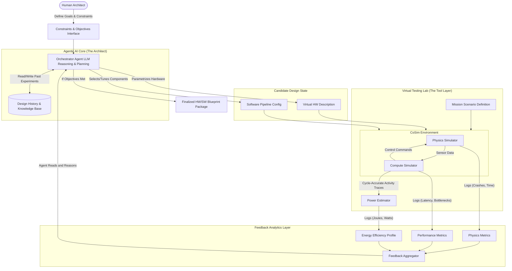

# System Architecture Diagram

The System Architecture Diagram visualizes how the "Agent" moves from an abstract reasoning entity to a practical engineering tool that manipulates other software.

Here is the architecture diagram of our Agentic HW/SW Co-Design Platform.

### System Architecture Diagram: The Agentic Co-Design Loop

This diagram illustrates the iterative loop where the **Orchestrator Agent** acts as the central nervous system. It takes high-level human constraints, generates concrete HW/SW designs, tests them in a "Virtual Lab" (compounded simulators), and uses the resulting energy and performance data to reason about the next design iteration.

### Diagram Breakdown for Markdown Documentation

**1. The Agentic AI Core (The Architect)**
At the center is the **Orchestrator Agent**, an LLM-based system capable of complex reasoning. Unlike simple optimization scripts, it doesn't just tweak numbers; it understands architectural concepts. It relies on a **Design History & Knowledge Base** (Memory) to remember past failures ("Reducing L2 cache too much causes SLAM tracking loss") and applies that knowledge to future iterations.

**2. The Candidate Design State**
In every iteration, the Agent outputs a specific, testable configuration. This is split into the **Software Pipeline Config** (e.g., deciding to use an `int8` quantized YOLO model running at 15fps) and the **Virtual HW Description** (e.g., defining a RISC-V core with a specific custom accelerator block attached).

**3. The Virtual Testing Lab (The Tool Layer)**
This is the engine room. The Agent doesn't run simulations itself; it uses "tools."

  * **Co-Simulation Environment:** This crucial block tightly couples physical world simulation (e.g., AirSim generating camera feeds) with digital hardware simulation (e.g., qemu/csim executing the software stack on virtual silicon). They must run in lockstep to ensure that a slow hardware design actually causes the drone to react slowly to obstacles in the physics simulator.
  * **Power Estimator:** It takes the detailed activity logs from the compute simulator (recording exactly which transistors were switching) and translates that into energy consumption metrics (Joules/Watts).

**4. The Feedback Analytics Layer**
Raw logs are turned into actionable insights. The output isn't just "it took 100 Joules." The output is a structured profile indicating, for example, that "The perception neural network consumed 60% of the total energy budget, and it was memory-bandwidth bound, not compute-bound."

**The Iteration Loop**
The **Feedback Aggregator** feeds this structured profile back to the **Orchestrator Agent**. The Agent reads this "report card," reasons about the bottlenecks, and begins the loop again by modifying the design state for the next test.

